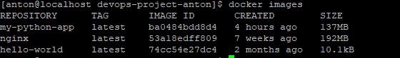
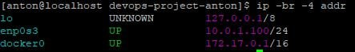

# DevOps Project by Anton Artemov  
**Цель:** Изучение Docker, Kubernetes, Prometheus/Grafana и ELK-стека.  

## День 1: Docker  
- Запуск контейнера Nginx.  
- Создание Docker-образа для Python-приложения.  

### Скриншоты:  
- **Docker-образы:**  
    
- **Работа приложения:**  
    
- **Сеть**
   


### Команды:  
```bash
# Запуск Python-приложения
docker run -d -p 5000:5000 --name my-python-app my-python-app

